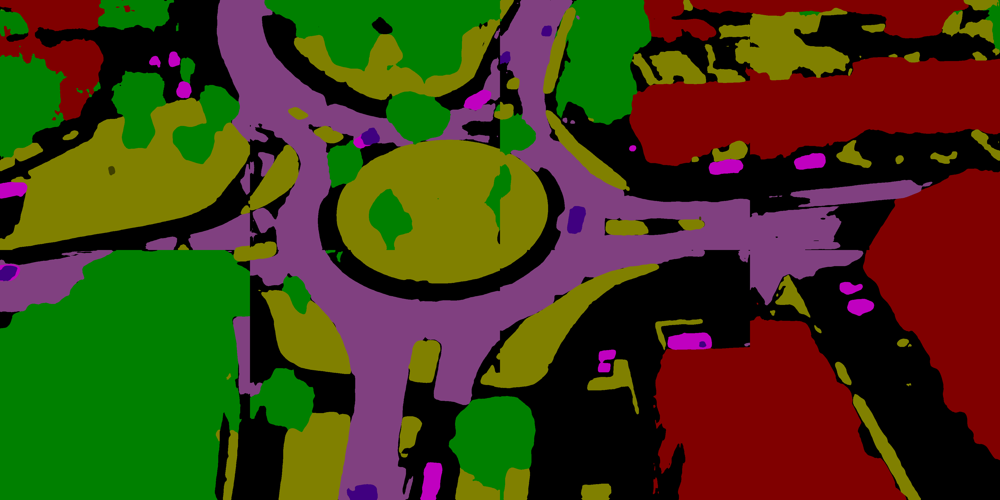

- # LSK-SCS-Unet

  <div>
  
  
  </div>

  

  ## Abstract

  Lsk-SCS-UNet is a lightweight and high-performance semantic segmentation model designed for high-resolution remote sensing images. It specifically addresses the challenges commonly found in urban remote sensing scenarios, such as significant object scale variation, complex semantic structures, and limited computational resources. The model adopts a hybrid architecture: the encoder leverages the Large Selective Kernel Network (LSKNet), which enables dynamic adjustment of spatial receptive fields, while the decoder employs the SS-Conv-SSM module, combining the local modeling strength of convolution with the long-range dependency modeling capabilities of the Mamba state space model, enabling efficient information integration and representation. To further enhance multi-scale feature interaction, the model incorporates a Multi-scale Feature Integration Module (MFIM), which effectively fuses spatial and channel features from different encoder levels. Experiments on the UAVid dataset demonstrate that Lsk-SCS-UNet outperforms existing state-of-the-art methods in both segmentation accuracy and model efficiency (FLOPs, parameters), making it well-suited for practical remote sensing applications under resource constraints—particularly for the UAVid dataset.

  | Methods       | backbone   | mIOU  | mF1   | OA    |
  | ------------- | ---------- | ----- | ----- | ----- |
  | DCSwin[34]     | Swin-Tiny  | 57.38 | 71.48 | 80.59 |
  | A2FPN[32]      | ResNet18   | 61.65 | 75.31 | 82.02 |
  | BANet[36]      | ResT-Lite  | 50.98 | 65.97 | 77.22 |
  | FTUNetFormer[35] | Swin-Base | 63.60 | 76.87 | 83.39 |
  | ABCNet[33]     | ResNet18   | 64.38 | 77.47 | 83.85 |
  | UNetFormer[7] | ResNet18   | 65.97 | 78.74 | 84.61 |
  | LSK-SCS-UNet   | LSKNet     | 68.00 | 80.21 | 86.00 |

  ## Install

  Open the folder **airs** using **Linux Terminal** and create python environment:

  ```
  conda create -n airs python=3.8
  conda activate airs
  pip3 install torch torchvision torchaudio --index-url https://download.pytorch.org/whl/cu118
  pip install -r GeoSeg/requirements.txt
  ```

  ```
  pip install packaging
  pip install timm==0.4.12
  pip install pytest chardet yacs termcolor
  pip install causal-conv1d>=1.4.0
  pip install mamba-ssm
  ```

  ```
  pip install -U openmim
  mim install mmcv-full
  mim install mmdet
  ```

  

  ## Pretrained Weights of Backbones

  [Baidu Disk](https://pan.baidu.com/s/1foJkxeUZwVi5SnKNpn6hfg) : 1234 

  [Google Drive](https://drive.google.com/drive/folders/1ELpFKONJZbXmwB5WCXG7w42eHtrXzyPn?usp=sharing)

  ## Data Preprocessing

  Download the datasets from the official website [UAVid 语义分割数据集](https://uavid.nl/) and split them yourself.

  **UAVid**

  ```
  python tools/uavid_patch_split.py \
  --input-dir "data/uavid/uavid_train_val" \
  --output-img-dir "data/uavid/train_val/images" \
  --output-mask-dir "data/uavid/train_val/masks" \
  --mode 'train' --split-size-h 1024 --split-size-w 1024 \
  --stride-h 1024 --stride-w 1024
  ```

  ```
  python tools/uavid_patch_split.py \
  --input-dir "data/uavid/uavid_train" \
  --output-img-dir "data/uavid/train/images" \
  --output-mask-dir "data/uavid/train/masks" \
  --mode 'train' --split-size-h 1024 --split-size-w 1024 \
  --stride-h 1024 --stride-w 1024
  ```

  ```
  python tools/uavid_patch_split.py \
  --input-dir "data/uavid/uavid_val" \
  --output-img-dir "data/uavid/val/images" \
  --output-mask-dir "data/uavid/val/masks" \
  --mode 'val' --split-size-h 1024 --split-size-w 1024 \
  --stride-h 1024 --stride-w 1024
  ```

  ```
  python tools/uavid_patch_split.py \
  --input-dir "data/uavid/uavid_test" \
  --output-img-dir "data/uavid/test/images" \
  --output-mask-dir "data/uavid/test/masks" \
  --mode 'train' --split-size-h 1024 --split-size-w 1024 \
  --stride-h 1024 --stride-w 1024
  ```

  ## Training

  "-c" means the path of the config, use different **config** to train different models.

  ```
  python train_supervision.py -c config/uavid/unetformer.py
  ```

  ## Testing

   `inference_uavid.py` script performs inference on the test dataset of the UAVid dataset.

  "-c" denotes the path of the config, Use different **config** to test different models. 

  "-o" denotes the output path 

  "-t" denotes the test time augmentation (TTA), can be [None, 'lr', 'd4'], default is None, 'lr' is flip TTA, 'd4' is multiscale TTA

  "--rgb" denotes whether to output masks in RGB format

  ```
  python inference_uavid.py \
  -i 'data/uavid/test/images' \
  -c config/uavid/lsk_convssm_test.py \
  -o output_img/new_test/lsk_convssm/patch
  ```

  ## Concat

  `concat.py` will piece images together.

  Before running, set `input_folder` and `output_folder` in `concat.py`

  ```
  python concat.py
  ```

  

